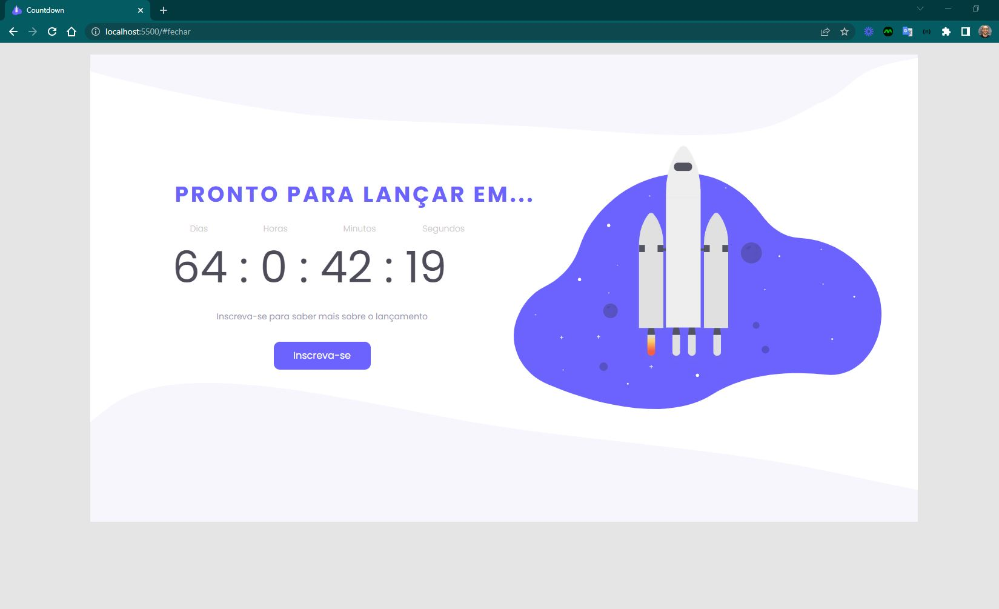

<h4 align="center"> 
	🚧 Countdown 🚀
</h4>

<p align="center" style="display: flex; align-items: flex-start; justify-content: center;">
  
</p>  

### 💻 Sobre o desafio

Neste desafio você deve criar uma página de coming soon (em breve) para o lançamento de um site, produto ou serviço, e na página deve ter um countdown timer (timer de contagem regressiva) informando quanto tempo falta para o lançamento.

#### 💻 Techs

- Nível de dificuldade: Intermediário
- Tecnologias: HTML, CSS e Javascript.

#### 💻 Como começar?

1 - Use o link do [Figma](https://www.figma.com/file/kz1YnxJpqKduyuMgnlBx1d/DD-%2F-Countdown-(Copy)?node-id=0%3A1) como base para o projeto. Também disponibilizamos para download todos os assets necessários (imagens e ícones), para fazer o download basta clicar no link acima.  

2 - Leia com atenção todas as instruções do desafio.

3 - Bora codar! Lembre-se que você pode usar as tecnologias que se sentir mais confortável, mas também pode se desafiar usando novas techs, fazendo modificações e/ou adicionando funcionalidades no projeto como preferir. 🚀

4 - Compartilhe seu resultado ou tire suas dúvidas na nossa [**comunidade aberta**](https://discord.gg/bacwY2gDCF)

### 💡 Conteúdos Aplicados

#### 💡 [Guia Estelar de Javascript](https://app.rocketseat.com.br/node/o-guia-estelar-de-java-script) 
As aulas deste conjunto abordam tipos de dados, variáveis, funções, manipulação de dados, expressões e aplicabilidade dos recursos. 

### 🚀 [Requisitos do projeto](https://efficient-sloth-d85.notion.site/Desafio-Countdown-4572ce6f5c91469abe0171f454a13e3f)

#### 🚀 Requisitos para o desafio 

##### 🚀 Requisitos Principais

- [ ] 1. A página deve ter um **countdown timer** com uma contagem regressiva para o tempo de lançamento.
- [ ] 2. Adicione um **botão** com o texto "inscreva-se".

Neste desafio você é livre para criar seu próprio layout ou pode usar o layout disponibilizado acima como base.

##### 🚀 Requisitos Extras

- [ ] 1. Adicione um modal que aparece quando o usuário clica no botão "Inscreva-se".
- [ ] 2. No modal adicione um formulário com inputs de nome, e-mail e um botão de envio.
 
### 🎨 Style Guide

#### 🎨 Cores

````css
:root {
  --black: #4D4C59;
  --purple: #6C63FF;
  --light-grey: #C8C8C8;
  --text-color: #9C9AB6;
}
````

#### 🎨 Tipo de fonte

- font-family: Poppins 
- font-weight: 400 e 500
- Você pode encontrar a fonte no [Google Fonts](https://fonts.google.com/)

#### 🎨 Como deve ficar a página ao final?

Ao finalizar o desafio você vai ter um resultado parecido com o da imagem abaixo.  

<p align="center" style="display: flex; align-items: flex-start; justify-content: center;">
  
</p>  

Bora lá?

### 📅 Entrega

Após concluí-los, adicionar esses códigos ao seu Github é uma boa forma de demonstrar seus conhecimentos para oportunidades futuras.

#### 📅 Tarefas

- [x] Organizando os detalhes do projeto no readme.md
- [x] Uma branch main e uma developer
- [x] Favicon
- [ ] [Learn Responsive Design](https://web.dev/learn/design/)
- [ ] [Learn CSS](https://web.dev/learn/css/)
- [x] Design sugerido construído

#### 📅 Telas

- Desktop, evolução do layout:

<p align="center" style="display: flex; align-items: flex-start; justify-content: center;">
  
</p>

Feito com ❤️ por Douglas A B Novato. 👋🏽 [Entre em contato!](https://www.linkedin.com/in/douglasabnovato/)
 
Fonte do projeto na [Rocketseat](https://www.rocketseat.com.br/). 👋 Participe da [comunidade aberta](https://discord.gg/bacwY2gDCF)!
